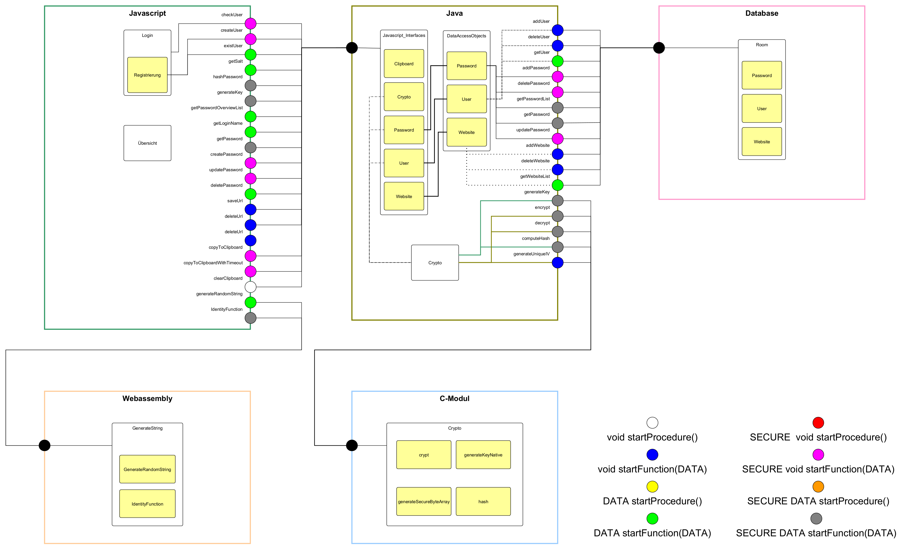

# Hybrider Passwortmanager

<!-- Shift to Wiki -->
Introduction:

OpenSSL Library:		cpp/include + cpp/libs
OnsenUI:				assests/onsenui
Webassembly:			assets/src/webAssembly
Room-Database:			


<div id="top"></div>

<!-- PROJECT SHIELDS -->
<!--
*** I'm using markdown "reference style" links for readability.
*** Reference links are enclosed in brackets [ ] instead of parentheses ( ).
*** See the bottom of this document for the declaration of the reference variables
*** for contributors-url, forks-url, etc. This is an optional, concise syntax you may use.
*** https://www.markdownguide.org/basic-syntax/#reference-style-links
-->
[![Contributors][contributors-shield]][contributors-url]
[![Forks][forks-shield]][forks-url]
[![Stargazers][stars-shield]][stars-url]
[![Issues][issues-shield]][issues-url]
[![MIT License][license-shield]][license-url]


<!-- PROJECT LOGO -->
<br />
<div align="center">
	<a href="https://github.com/bp-group-60/Hybrider-Passwortmanager">
		
	</a>

<h3 align="center">Hybrider Passwortmanager</h3>
	<p align="center">
		is created for the data flow analysis
		<br />
		<a href="https://github.com/bp-group-60/Hybrider-Passwortmanager/wiki"><strong>Explore the wiki »</strong></a>
		<br />
	</p>
</div>


<!-- TABLE OF CONTENTS -->
<details>
	<summary>Table of Contents</summary>
	<ol>
		<li>
			<a href="#about-the-project">About The Project</a>
			<ul>
				<li><a href="#built-with">Built With</a></li>
			</ul>
		</li>
		<li>
			<a href="#getting-started">Getting Started</a>
			<ul>
				<li><a href="#prerequisites">Prerequisites</a></li>
				<li><a href="#installation">Installation</a></li>
			</ul>
		</li>
		<li><a href="#usage">Usage</a></li>
		<li><a href="#features">Features</a></li>
		<li><a href="#license">License</a></li>
		<li><a href="#acknowledgments">Acknowledgments</a></li>
	</ol>
</details>

<!-- ABOUT THE PROJECT -->
## About The Project -- deprecated, transfer in wiki detailed explanation

The App is devided into 2 sections: the frontend and the backend. The frontend has a login/register site and the password-overview page to see, edit and add passwords. On the backend side, we have a `Java Dataflowmanager` to get the data from the `SQLite Datbase` and encrypt & decrypt the data in the `C-Cryption` section, so the requested informations can be forwarded to the frontend and been shown there.

A dataflow-diagram is shwon below:<br>
[](images/diagram.png)

### Built With

* [OnsenUI](https://nextjs.org/)
* [Python](https://www.python.org/)
* [emscripten](https://emscripten.org/docs/)
* [prebuilt openSSL-Library](https://github.com/PurpleI2P/OpenSSL-for-Android-Prebuilt)
* [Room Database](https://developer.android.com/reference/android/arch/persistence/room/RoomDatabase)

<!-- GETTING STARTED -->
## Getting Started
For editing and building the project [Android Studio](https://developer.android.com/studio) comes with all reqirements and is therefore recommended.

### Installation
1. Clone the repo
	 ```sh
	 git clone https://github.com/bp-group-60/Hybrider-Passwortmanager.git
	 ```
2. Import in IDE (Android Studio or MS Visual Studio Code tested)

or just use the build in vcs tools

### Building
For building this project use gradle's default build configuration.

### Running
To get proper functionality at least SDK 24 (Android 7) and a WebView version that supports ES6 is required.

<!-- USAGE EXAMPLES -->
## Usage -- deprecated, transfer in wiki detailed explanation
After starting the app on the phone, there is a login screen. If you dont have any account, you can create one using the register site and insert your username, email and masterpassword. The masterpassword will be hashed and used for verification during the login process. After a successful login, the user can see his password list with the application name and the username, which has been used there. The user is capable to add new passwords or select an entry. Adding a password requires an application name, a username and password. The app supports generating passwords to you. Optional the user can add URLs to the password entry.<br>
When the user selects an password entry, he can copy the password into clipboard or edit or even delete the entry. While editing the entry, the user now can only change username, password and URLs. The password generation is also usable in the edit screen.

_For more and detailed explaination of each part of every section, please visit the [Wiki](https://github.com/bp-group-60/Hybrider-Passwortmanager/wiki)_

<!-- FEATURES -->
## Features
After starting the app on the phone you can:
* create an account and login into the app
* create and view login information for a website including:
  * url items (saved in plain)
  * login name (saved in plain)
  * login password (saved encrypted)
* manage all saved data

<!-- LICENSE -->
## License

Distributed under the MIT License. See [LICENSE](https://github.com/bp-group-60/Hybrider-Passwortmanager/blob/main/LICENSE) for more information.

<!-- ACKNOWLEDGMENTS -->
## Acknowledgments

* [emscripten Tutorial](https://emscripten.org/docs/getting_started/Tutorial.html)


<!-- MARKDOWN LINKS & IMAGES -->
<!-- https://www.markdownguide.org/basic-syntax/#reference-style-links -->
[contributors-shield]: https://img.shields.io/github/contributors/bp-group-60/Hybrider-Passwortmanager.svg?style=for-the-badge
[contributors-url]: https://github.com/bp-group-60/Hybrider-Passwortmanager/graphs/contributors
[forks-shield]: https://img.shields.io/github/forks/bp-group-60/Hybrider-Passwortmanager.svg?style=for-the-badge
[forks-url]: https://github.com/bp-group-60/Hybrider-Passwortmanager/network/members
[stars-shield]: https://img.shields.io/github/stars/bp-group-60/Hybrider-Passwortmanager.svg?style=for-the-badge
[stars-url]: https://github.com/bp-group-60/Hybrider-Passwortmanager/stargazers
[issues-shield]: https://img.shields.io/github/issues/bp-group-60/Hybrider-Passwortmanager.svg?style=for-the-badge
[issues-url]: https://github.com/bp-group-60/Hybrider-Passwortmanager/issues
[license-shield]: https://img.shields.io/github/license/bp-group-60/Hybrider-Passwortmanager.svg?style=for-the-badge
[license-url]: https://github.com/bp-group-60/Hybrider-Passwortmanager/blob/master/LICENSE.txt